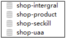
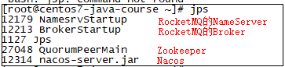
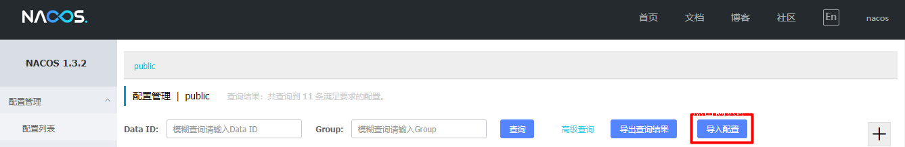
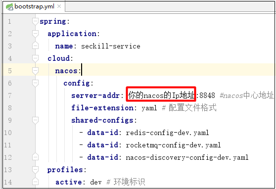

# 项目启动

```
/usr/local/nacos/bin/startup.sh -m standalone
nohup sh mqnamesrv &
nohup sh mqbroker -n localhost:9876 -c /usr/local/rocketmq-4.4/conf/broker.conf &
/usr/local/zookeeper-3.4.11/bin/zkServer.sh start
nohup /usr/local/seata/bin/seata-server.sh -h 192.168.199.129 -p 7000 >log.out 2>1 &
sh /tmp/canal/bin/startup.sh
```


# 限时抢购项目导入文档

1.使用git clone将项目导入到你的本地目录中

2.通过idea工具将`frontend-server`项目和`shop-parent`导入

3.在flash_sale/shop-parent/配置文件/SQL脚本下的文件导入到数据库中.

```sql
-shop-intergral.sql
-shop-product.sql
-shop-seckill.sql
-shop-uaa.sql
```

导入后的结果如下:

****

4.本项目需要依赖RocketMQ,Redis,Nacos,Zookeeper,在项目运行之前确保这几个软件在你的电脑/虚拟机/远程服务器中已经安装好.比如在服务器上已经安装好之后，使用命令`jps`可以看到这几个进程:

****

5.在`flash_sale/shop-parent/配置文件/nacos配置`中找到项目的配置文件压缩包`nacos_config.zip`，访问nacos管控台,导入配置信息.



6.修改配置信息

- `rocketmq-config-dev.yaml`:修改成你的RocketMQ的地址
- `redis-config-dev.yaml`:修改成你的Redis的地址
- `job-service-dev.yaml`:修改成你的Zookeeper的地址
- `nacos-discovery-config-dev.yaml`:修改成你的Nacos的地址

项目中的`bootstrap.yml`的地址都需要修改

****


# 阅读代码 

## 1.前后端分离，跨域问题如何解决？

在网关的`CorsConfig`中

## 2.在微服务中如何获取到真实的IP


## 3.登录流程图


## 4.用Redis+Token实现分布式Session，如何跟新redis时间？

在代码CommonFilter中


# 实战

## 秒杀列表需求


## 秒杀初步实现

**feign远程调用返回值**


**远程调用获取的数据**

当远程返回为null或者状态码不是200的时候，获取数据失败


1.秒杀服务

```java
@RequestMapping("/queryByTime")
    public Result<List<SeckillProductVo>>queryByTime(Integer time){
        return Result.success(seckillProductService.queryByTime(time));
    }
```

```java
@Service
public class SeckillProductServiceImpl implements ISeckillProductService {
    @Autowired
    private SeckillProductMapper seckillProductMapper;
    @Autowired
    private StringRedisTemplate redisTemplate;
    @Autowired
    private RocketMQTemplate rocketMQTemplate;
    @Autowired
    private ProductFeignApi productFeignApi;

    @Override
    public List<SeckillProductVo> queryByTime(Integer time) {
        // 1.查询秒杀商品数据(根据场次)
        List<SeckillProduct> seckillProducts = seckillProductMapper.queryCurrentlySeckillProduct(time);
        if(seckillProducts.size()==0){
            return Collections.EMPTY_LIST;
        }
        // 2.便利秒杀商品集合数据，获取商品id集合
        List<Long>productIds = new ArrayList<>();
        for (SeckillProduct seckillProduct : seckillProducts) {
            productIds.add(seckillProduct.getProductId());
        }
        // 3.远程调用，获取商品集合
        Result<List<Product>> result = productFeignApi.queryByIds(productIds);
        if(result==null||result.hasError()){
            throw new BusinessException(SeckillCodeMsg.PRODUCT_SERVER_ERROR);
        }
        List<Product>productList = result.getData();
        Map<Long,Product>productMap = new HashMap<>();
        for (Product product : productList) {
            productMap.put(product.getId(),product);
        }
        // 4.将商品和秒杀商品数据集合，封装vo对象并返回
        List<SeckillProductVo>seckillProductVoList = new ArrayList<>();
        for (SeckillProduct seckillProduct : seckillProducts) {
            SeckillProductVo vo = new SeckillProductVo();
            Product product = productMap.get(seckillProduct.getProductId());
            BeanUtils.copyProperties(product,vo);
            BeanUtils.copyProperties(seckillProduct,vo);
            vo.setCurrentCount(seckillProduct.getStockCount());// 当前数量默认是商品数量
            seckillProductVoList.add(vo);
        }
        return seckillProductVoList;
    }
}
```


加上服务降级的配置

```yaml
feign:
  sentinel:
    enabled: true
```

```java
@FeignClient(name = "product-service",fallback = ProductFeignFallback.class)
public interface ProductFeignApi {
    @RequestMapping("/product/queryByIds")
    Result<List<Product>>queryByIds(@RequestParam List<Long>productIds);
}
```

```java
@Component
public class ProductFeignFallback implements ProductFeignApi {

    @Override
    public Result<List<Product>> queryByIds(List<Long> productIds) {
        // 返回兜底数据
        return null;
    }
}
```

2.商品服务

```java
@RestController
@RequestMapping("/product")
public class ProductFeignClient {

    @Autowired
    private IProductService productService;

    @RequestMapping("/queryByIds")
    public Result<List<Product>> queryByIds(@RequestParam List<Long>productIds){
        return Result.success(productService.queryByIds(productIds));
    }
}
```

```java
@Service
public class ProductServiceImpl implements IProductService {
    @Autowired
    private ProductMapper productMapper;

    @Override
    public List<Product> queryByIds(List<Long> productIds) {
        if(productIds==null||productIds.size()==0){
            return Collections.EMPTY_LIST;
        }
        return productMapper.queryProductByIds(productIds);
    }
}
```


## 秒杀需求分析

需求:
1.购买数量的限制,一个人只能抢购一次.

⒉购买的时候需要登录才能进行抢购. (在一定程度可以进行限流)

3.需要在给定的时间才能进行抢购

4.如果充足才能进行抢购

```
---原子性
创建秒杀订单
库存数量-1
---
```


### 登录才可以抢购分析与实现


`


## 秒杀功能

```java
 @RequestMapping("/doSeckill")
    @RequireLogin
    public Result<String>doSeckill(Integer time, Long seckillId, HttpServletRequest request){
        // 1.判断是否处于抢购的时间
        SeckillProductVo seckillProductVo = seckillProductService.find(time, seckillId);
        boolean legalTime = DateUtil.isLegalTime(seckillProductVo.getStartDate(), seckillProductVo.getTime());
//        if(!legalTime){
//            return Result.error(CommonCodeMsg.ILLEGAL_OPERATION);
//        }
        // 2.一个用户只能抢购一个商品
        // 获取token信息
        String token = request.getHeader(CommonConstants.TOKEN_NAME);
        // 根据token从redis中获取手机号
        String userPhone = UserUtil.getUserPhone(redisTemplate, token);
        OrderInfo orderInfo = orderInfoService.findByPhoneAndSeckillId(userPhone,seckillId);
        if(orderInfo!=null){
            // 提示重复下单
            System.out.println("11");
            return Result.error(SeckillCodeMsg.REPEAT_SECKILL);
        }
        // 3.保证库存数量足够
        if(seckillProductVo.getStockCount()<=0){
            return Result.error(SeckillCodeMsg.SECKILL_STOCK_OVER);
        }
        orderInfo = orderInfoService.doSeckill(userPhone,seckillProductVo);

        return Result.success();
    }
```

```java
@Service
public class OrderInfoSeviceImpl implements IOrderInfoService {
    @Autowired
    private ISeckillProductService seckillProductService;
    @Autowired
    private OrderInfoMapper orderInfoMapper;
    @Autowired
    private StringRedisTemplate redisTemplate;
    @Autowired
    private PayLogMapper payLogMapper;
    @Autowired
    private RefundLogMapper refundLogMapper;

    @Override
    public OrderInfo findByPhoneAndSeckillId(String userPhone, Long seckillId) {
        return orderInfoMapper.findByPhoneAndSeckillId(userPhone,seckillId);
    }

    @Override
    @Transactional
    public OrderInfo doSeckill(String userPhone, SeckillProductVo seckillProductVo) {
        // 4.扣减数据库库存
        seckillProductService.dercStockCount(seckillProductVo.getId());
        // 5.创建秒杀订单
        OrderInfo orderInfo = createOrderInfo(userPhone,seckillProductVo);
        return  orderInfo;
    }

    private OrderInfo createOrderInfo(String userPhone, SeckillProductVo seckillProductVo) {
        OrderInfo orderInfo = new OrderInfo();
        BeanUtils.copyProperties(seckillProductVo,orderInfo);
        orderInfo.setUserId(Long.parseLong(userPhone));
        orderInfo.setCreateDate(new Date());
        orderInfo.setDeliveryAddrId(1L);
        orderInfo.setSeckillDate(seckillProductVo.getStartDate());
        orderInfo.setSeckillTime(seckillProductVo.getTime());
        orderInfo.setOrderNo(String.valueOf(IdGenerateUtil.get().nextId()));
        orderInfo.setSeckillId(seckillProductVo.getId());
        orderInfoMapper.insert(orderInfo);
        return orderInfo;
    }
}
```


### jmuter对秒杀列表和秒杀详情进行测试


### 模拟多用户抢商品


结果数据库中出现超卖现象。后面会解决


## 定时上架的需求分析


```java
@Component
@Getter
@Setter
public class InitSeckillProductJob implements SimpleJob {

    @Value("${jobCron.initSeckillProduct}")
    private String cron;

    @Autowired
    private SeckillProductFeignAPI seckillProductFeignAPI;
    @Autowired
    private StringRedisTemplate redisTemplate;

    @Override
    public void execute(ShardingContext shardingContext) {
        // 1.远程调用秒杀服务获取秒杀列表集合
        String time = shardingContext.getShardingParameter();
        Result<List<SeckillProductVo>> result = seckillProductFeignAPI.queryByTimeForJob(Integer.parseInt(time));
        if(result==null|| result.hasError()){
            // 通过管理员
            return;
        }
        List<SeckillProductVo> seckillProductVos = result.getData();
        // 2，删除之前的数据
        String key = JobRedisKey.SECKILL_PRODUCT_HASH.getRealKey(time);
        redisTemplate.delete(key);
        // 3.存储集合数据到redis中
        for (SeckillProductVo vo : seckillProductVos) {
            redisTemplate.opsForHash().put(key,String.valueOf(vo.getId()), JSON.toJSONString(vo));
        }
    }
}
```

```java
@FeignClient(name = "seckill-service",fallback = SeckillProductFeignFallbck.class)
public interface SeckillProductFeignAPI {
    @RequestMapping("/seckillProduct/queryByTimeForJob")
    Result<List<SeckillProductVo>>queryByTimeForJob(@RequestParam("time") Integer time);
}
```

```java
@Bean(initMethod = "init")
    public SpringJobScheduler initSPJob(CoordinatorRegistryCenter registryCenter, InitSeckillProductJob seckillProductJob){
        LiteJobConfiguration jobConfiguration = ElasticJobUtil.createJobConfiguration(
                seckillProductJob.getClass(), seckillProductJob.getCron(),3,
                "0=10,1=12,2=14",false);
        SpringJobScheduler springJobScheduler = new SpringJobScheduler(seckillProductJob, registryCenter,jobConfiguration );
        return springJobScheduler;
    }
```


```java
@RestController
@RequestMapping("/seckillProduct")
public class SeckillFeignClient {

    @Autowired
    private ISeckillProductService seckillProductService;

    @RequestMapping("/seckillProduct/queryByTimeForJob")
    public Result<List<SeckillProductVo>> queryByTimeForJob(@RequestParam("time") Integer time){
        return Result.success(seckillProductService.queryByTime(time));
    }
}
```

## 优化接口

### 优化前面的秒杀列表和详情接口

```java
@RequestMapping("/queryByTime")
    public Result<List<SeckillProductVo>>queryByTime(Integer time){
//        return Result.success(seckillProductService.queryByTime(time));
        return Result.success(seckillProductService.queryByTimeFromCache(time));
    }

    @RequestMapping("/find")
    public Result<SeckillProductVo>find(Integer time,Long seckillId){
//        return Result.success(seckillProductService.find(time,seckillId));
        return Result.success(seckillProductService.findFromCache(time,seckillId));
    }
```

```java
@Override
    public List<SeckillProductVo> queryByTimeFromCache(Integer time) {
        String key = SeckillRedisKey.SECKILL_PRODUCT_HASH.getRealKey(String.valueOf(time));
        List<Object> objStrList = redisTemplate.opsForHash().values(key);
        List<SeckillProductVo>seckillProductVoList = new ArrayList<>();
        for (Object objStr : objStrList) {
            seckillProductVoList.add(JSON.parseObject((String) objStr,SeckillProductVo.class));
        }
        return seckillProductVoList;
    }

    @Override
    public SeckillProductVo findFromCache(Integer time, Long seckillId) {
        String key = SeckillRedisKey.SECKILL_PRODUCT_HASH.getRealKey(String.valueOf(time));
        Object obj = redisTemplate.opsForHash().get(key, String.valueOf(seckillId));
        SeckillProductVo vo = JSON.parseObject((String)obj,SeckillProductVo.class);
        return vo;
    }
```

### 优化之后进行测试


### 优化秒杀功能，解决超卖问题


超卖兜底解决方案：


重复下单的优化：

1.使用数据库唯一索引保证不会重复抢购

2.使用redis的set结构优化查询


在秒杀服务OrderInfoController中加入

```java
// 优化:使用redis控制秒杀请求的人数
        String seckillStockCountKey = SeckillRedisKey.SECKILL_STOCK_COUNT_HASH.getRealKey(String.valueOf(time));
        Long remainCount = redisTemplate.opsForHash().increment(seckillStockCountKey, String.valueOf(seckillId), -1);
        if(remainCount<0){
            return Result.error(SeckillCodeMsg.SECKILL_STOCK_OVER);
        }
```

在定时任务InitSeckillProductJob加入

```java
// 优化：库存数量key
String seckillStockCountKey = JobRedisKey.SECKILL_STOCK_COUNT_HASH.getRealKey(time);
redisTemplate.delete(seckillStockCountKey);

// 优化：将库存同步到redis
redisTemplate.opsForHash().put(seckillStockCountKey,String.valueOf(vo.getId()),String.valueOf(vo.getStockCount()));
```


判断用户是否已下单

```java
// 原本从数据库判断用户是否秒杀该商品 改为从redis的set中判断
//        OrderInfo orderInfo = orderInfoService.findByPhoneAndSeckillId(userPhone,seckillId);
//        if(orderInfo!=null){
//            // 提示重复下单
//            return Result.error(SeckillCodeMsg.REPEAT_SECKILL);
//        }
        String orderSetKey = SeckillRedisKey.SECKILL_ORDER_SET.getRealKey(String.valueOf(seckillId));
        if(redisTemplate.opsForSet().isMember(orderSetKey,userPhone)){
            // 提示重复下单
            return Result.error(SeckillCodeMsg.REPEAT_SECKILL);
        }
```

````java
 // 在redis中设置set集合，存储的是抢到商品用户的手机号码
        String orderSetKey = SeckillRedisKey.SECKILL_ORDER_SET.getRealKey(String.valueOf(seckillProductVo.getId()));
        redisTemplate.opsForSet().add(orderSetKey,userPhone);
````

### 优化之后测试秒杀接口

没有超卖的问题


## 异步下单分析


## 小总结

1.定时上架功能

- 在虚拟中配置zookeeper,并在job-service-dev.yaml配置zookeeper地址
- 定义Job类(分片处理)
  - 远程调用秒杀服务,获取秒杀列表集合
  - 删除之前的key
  - 使用Hash结构存储秒杀列表
- 在配置类中配置SpringJob对象.(分片3片,分片参数"0=10,1=12,2=14")
- 修改秒杀列表接口(从redis中获取)
- 修改秒杀详情接口(从redis中获取)
- 通过Jmeter进行压测(不是必要)

⒉.解决超卖的问题

- 使用乐观锁的思想. 	`update t seckill product set stock count = stock count - 1 where id = #(seckilld} and stock count > 0`保证一定不会出现超卖的情况.
- 上面的方式解决超卖的问题,但是大量请求进来,大部分请求都不能修改库存,造成数据库压力很大

3.使用Redis原子性递减控制秒杀的人数

- 目的减少请求进入到数据库中.
- 在定时任务中,把库存同步到Redis,使用Hash接口(利用原子性递减)
- 修改秒杀的逻辑
  - 在Redis进行递减操作,获取剩余数量remainCountif(remainCount<0){
    	//没有库存,抛出异常
    }

4.使用唯—索引解决重复下单的问题

- 在数据库中建立user_id,seckill_id 唯一索引,可以保证不会出现重复下单情况
- 在订单创建完成之后,往数据库中存储set集合. OrderSet:12 ===>[13088889999
- 在秒杀接口判断用户是否重复下单,使用Redis的方法判断Set集合是否存在当前用户的phone.
- 进行2.0压测

5.分析异步下单情况

- 一个秒杀商品有50个请求进入数据库,但是同一个场次可能会有很多的秒杀商品比如100个.同时会有100*50个请求同时进入到数据库中数据库压力大
- 使用MQ进行异步处理.
  - 如果解决处理结果通知.
    - 使用Ajax轮询(定时器不断发送请求)
    - 使用WebSocket建立长连接.


## MQ异步下单

```java
//        OrderInfo orderInfo = orderInfoService.doSeckill(userPhone,seckillProductVo);
        // 使用MQ方式进行异步下单
        OrderMessage message = new OrderMessage(time, seckillId, token, Long.parseLong(userPhone));
        rocketMQTemplate.syncSend(MQConstant.ORDER_PEDDING_TOPIC,message);
```

```java
@Component
@RocketMQMessageListener(consumerGroup = "peddingGroup",topic = MQConstant.ORDER_PEDDING_TOPIC)
public class OrderPeddingQueueListener implements RocketMQListener<OrderMessage> {

    @Autowired
    private IOrderInfoService orderInfoService;
    @Autowired
    private ISeckillProductService seckillProductService;
    @Autowired
    private RocketMQTemplate rocketMQTemplate;

    @Override
    public void onMessage(OrderMessage orderMessage) {
        OrderMQResult result = new OrderMQResult();
        result.setToken(orderMessage.getToken());
        String tag;
        try{
            SeckillProductVo vo = seckillProductService.findFromCache(orderMessage.getTime(), orderMessage.getSeckillId());
            OrderInfo orderInfo = orderInfoService.doSeckill(String.valueOf(orderMessage.getUserPhone()), vo);
            result.setOrderNo(orderInfo.getOrderNo());
            tag=MQConstant.ORDER_RESULT_SUCCESS_TAG;
        }catch (Exception e){
            e.printStackTrace();
            result.setTime(orderMessage.getTime());
            result.setSeckillId(orderMessage.getSeckillId());
            result.setCode(SeckillCodeMsg.SECKILL_ERROR.getCode());
            result.setMsg(SeckillCodeMsg.SECKILL_ERROR.getMsg());
            tag=MQConstant.ORDER_RESULT_FAIL_TAG;
        }
        rocketMQTemplate.syncSend(MQConstant.ORDER_RESULT_TOPIC+":"+tag,result);
    }
}
```

```java
    @Bean
    public ServerEndpointExporter serverEndpointExporter(){
        return new ServerEndpointExporter();
    }
```

```java
@ServerEndpoint("/{token}")
@Component
public class OrderWSServer{
    public static ConcurrentHashMap<String, Session>clients=new ConcurrentHashMap<>();

    @OnOpen
    public void onOpen(Session session, @PathParam("token") String token){
        System.out.println("浏览器和服务器建立连接；"+token);
        clients.put(token,session);
    }
    @OnClose
    public void onClose(@PathParam("token") String token){
        System.out.println("浏览器和服务器断开链接"+token);
        clients.remove(token);
    }
    @OnError
    public void onError(Throwable error){
        error.printStackTrace();
    }
}
```

```java
@Component
@RocketMQMessageListener(consumerGroup = "OrderResultGroup",topic = MQConstants.ORDER_RESULT_TOPIC)
public class OrderResultQueueListener implements RocketMQListener<OrderMQResult> {
    @Override
    public void onMessage(OrderMQResult orderMQResult) {
        // 找到客户端
        Session session = null;
        int count = 3;
        while(count-->0){
            session = OrderWSServer.clients.get(orderMQResult.getToken());
            if(session!=null){
                // 说明已经拿到了，发送消息
                try {
                    session.getBasicRemote().sendText(JSON.toJSONString(orderMQResult));
                } catch (IOException e) {
                    e.printStackTrace();
                }
                return;
            }
            try {
                TimeUnit.MILLISECONDS.sleep(100);
            } catch (InterruptedException e) {
                e.printStackTrace();
            }
        }
    }
}
```

### 预库存回补

解决方案：

查询数据库的库存，如果库存数量>0，将数值更新到redis中。

这样可能会导致比如有10个请求都进入了mq中，第一个成功，此时数据库库存为9，第2个失败，此时将数据库库存9修改到redis中。还允许有9个发送请求，但因此在数据库方面设置了stock_count>0的查询条件，兜底方案。因此最终只能有10个秒杀成功

```java
@Component
@RocketMQMessageListener(consumerGroup = "OrderResultFailGroup",
        topic = MQConstant.ORDER_RESULT_TOPIC,selectorExpression = MQConstant.ORDER_RESULT_FAIL_TAG)
public class OrderResutlFailQueueListenter implements RocketMQListener<OrderMQResult> {
    @Autowired
    private ISeckillProductService seckillProductService;
    @Override
    public void onMessage(OrderMQResult orderMQResult) {
        System.out.println("失败进行预库存回补");
        seckillProductService.syncStockToRedis(orderMQResult.getTime(),orderMQResult.getSeckillId());
    }
}
```

```java
    @Override
    public void syncStockToRedis(Integer time, Long seckillId) {
        SeckillProduct seckillProduct = seckillProductMapper.getSeckillProductBySeckillId(seckillId);
        if(seckillProduct.getStockCount()>0){
            String key = SeckillRedisKey.SECKILL_STOCK_COUNT_HASH.getRealKey(String.valueOf(time));
            redisTemplate.opsForHash().put(key,String.valueOf(seckillId),String.valueOf(seckillProduct.getStockCount()));
        }
    }
```

### 超时取消订单

```java
// 发送延迟消息
Message<OrderMQResult> message = MessageBuilder.withPayload(result).build();       rocketMQTemplate.syncSend(MQConstant.ORDER_PAY_TIMEOUT_TOPIC,message,3000,MQConstant.ORDER_PAY_TIMEOUT_DELAY_LEVEL);
```

```java
@Component
@RocketMQMessageListener(consumerGroup = "OrderPayTimeOutGroup",topic = MQConstant.ORDER_PAY_TIMEOUT_TOPIC)
public class OrderPayTimeOutQueueListener implements RocketMQListener<OrderMQResult> {

    @Autowired
    private IOrderInfoService orderInfoService;

    @Override
    public void onMessage(OrderMQResult orderMQResult) {
        // 进入这，说明已经过10分钟了
        // 取消订单
        System.out.println("超时取消订单逻辑");
        orderInfoService.cancelOrder(orderMQResult.getOrderNo());
    }
}
```

```java
@Override
    @Transactional
    public void cancelOrder(String orderNo) {
        System.out.println("超时取消订单开始。。。");

        OrderInfo orderInfo = orderInfoMapper.find(orderNo);
        // 判断订单是否处于未付款状态
        if(OrderInfo.STATUS_ARREARAGE.equals(orderInfo.getStatus())){
            // 修改订单状态
            int effectCount = orderInfoMapper.updateCancelStatus(orderNo, OrderInfo.STATUS_TIMEOUT);
            if(effectCount==0){
                return;
            }
            // 真实库存回补
            seckillProductService.incrStockCount(orderInfo.getSeckillId());
            // 预库存回补
            seckillProductService.syncStockToRedis(orderInfo.getSeckillTime(),orderInfo.getSeckillId());
        }
        System.out.println("超时取消订单结束。。。");

    }
```

```java
    @Override
    public void incrStockCount(Long seckillId) {
        seckillProductMapper.incrStock(seckillId);
    }
```


## 小总结

1.SpringBoot集成WebSocket

- 添加依赖

- 配置Bean,扫描@EndPointServer注解

  ```java
  @Bean
  public ServerEndpointExporter serverEndpointExporter) {
  	return new ServerEndpointExporter);
  }
  ```

- 处理类

  ```java
  @serverEndpoint(" /{token}")
  @Component
  public class OrderWSServer {
  	@OnOpen
  	public void onOpen(Session session,@PathParam( "token")String token){}
      ...
  }
  ```

  @OnOpen:浏览器和服务器建立连接触发的方法

  @OnMessage:接收到客户端的信息会触发的方法

  @OnClose:客户端关闭的时候触发的方法
  @OnError:连接出现异常的时候触发该方法

- Websocket相关面试题

  - 很多请求建立连接的时候应该如何应对?
    使用nginx做负载,做集群．集群后使用MQ广播进行通知
  - 客户端端口网络的情况下,如果将已经丢失链接释放.
    需要心跳机制.
  - 可以使用付费的websocket服务,比如GoEasy

2.异步下单的功能

- 在OrderlnfoController中变成异步下单
  - 将参数封装OrderMessage对象(time,phone,seckillld,token)
  - 使用RokcetMQTemplate发送消息
- 在秒杀服务中写监听类
  - 对秒杀方法的进行捕获异常.
    - 如果没有异常
      - 发送延时消息
      - 发送结果消息(添加成功Tag)
    - 如果有异常
      - 发送结果消息(添加失败Tag)

3.集成Websocket服务

- 在OnOpen方法维护和客户端的映射关系,需要使用ConcurrentHashMap
- 监听结果消息,获取里面的token找到客户端,进行消息发送(实现消息重试机制)

4.处理预库存回补问题

- 当进入队列之后,在进行秒杀的时候,请求出错了.预库存扣减了,但是真实库存没有扣减.出现商品少买的情况.增加预库存,放请求进来把库存消化了.
- 进行消息结果的监听,在秒杀服务中写监听类需要对消息进行过滤,只需要失败的消息.
  - 查询数据库的库存,如果大于0,将库存信息同步到Redis中

5.处理超时支付取消订单逻辑

- 秒杀成功之后,发送消息到延时队列.用于处理超时取消的订单
- 在秒杀服务中写监听类
  查询对应的订单的状态,是否为未支付-如果是未支付
  - 修改订单状态(可能会有并发的情况出现,使用状态机)
  - 真实库存+1
  - 查询数据库同步预库存-如果是其他状态,不需要处理

## 支付宝支付


内网穿透 `https://natapp.cn/`

natapp配置步骤`[NATAPP1分钟快速新手图文教程 - NATAPP-内网穿透 基于ngrok的国内高速内网映射工具](https://natapp.cn/article/natapp_newbie)`


```java
@RequestMapping("/pay")
    public Result<String>pay(String orderNo,Integer type){
        if(OrderInfo.PAYTYPE_ONLINE.equals(type)){
            // 在线支付
            return orderInfoService.payOnline(orderNo);
        }else{
            // 积分支付
        return null;
        }
    }
```

```java
public Result<String> payOnline(String orderNo) {
        // 根据订单号查询订单对象
        OrderInfo orderInfo = this.findByOrderNo(orderNo);
        PayVo payVo = new PayVo();
        payVo.setBody(orderInfo.getProductName());
        payVo.setSubject(orderInfo.getProductName());
        payVo.setOutTradeNo(orderNo);
        payVo.setTotalAmount(String.valueOf(orderInfo.getSeckillPrice()));
        Result<String>result=payFeignApi.payOnline(payVo);
        return result;
    }
```

```java
@FeignClient(name = "pay-service",fallback = PayFeignApiFallback.class)
public interface PayFeignApi {
    @RequestMapping("/alipay/payOnline")
    Result<String>payOnline(@RequestBody PayVo vo);
}
```

```java
@Component
public class PayFeignApiFallback implements PayFeignApi {
    @Override
    public Result<String> payOnline(PayVo vo) {
        return null;
    }
}
```

```java
@RestController
@RequestMapping("/alipay")
public class AlipayController {
    @Autowired
    private AlipayClient alipayClient;
    @Autowired
    private AlipayProperties alipayProperties;

    @RequestMapping("/payOnline")
    public Result<String>payOnline(@RequestBody PayVo vo) throws AlipayApiException {
        AlipayTradePagePayRequest alipayRequest = new AlipayTradePagePayRequest();
        alipayRequest.setReturnUrl(vo.getReturnUrl());//同步通知地址
        alipayRequest.setNotifyUrl(vo.getNotifyUrl());//异步通知地址
        alipayRequest.setBizContent("{\"out_trade_no\":\""+ vo.getOutTradeNo() +"\","
                + "\"total_amount\":\""+ vo.getTotalAmount() +"\","
                + "\"subject\":\""+ vo.getSubject() +"\","
                + "\"body\":\""+ vo.getBody() +"\","
                + "\"product_code\":\"FAST_INSTANT_TRADE_PAY\"}");
        String html = alipayClient.pageExecute(alipayRequest).getBody();
        return Result.success(html);
    }
}
```


```java
    // 异步回调
    @RequestMapping("/notifyUrl")
    public String notifyUrl(@RequestParam Map<String,String>params){
        Result<Boolean>result=payFeignApi.rsaCheckV1(params);
        if(result==null||result.hasError()){
            return "fail";
        }
        Boolean signVerified = result.getData();// 验证SDK签名
        if(signVerified){
            // 验签成功，修改订单状态
            String orderNo = params.get("out_trade_no");
            int effectCount = orderInfoService.changePayStatus(orderNo, OrderInfo.STATUS_ACCOUNT_PAID, OrderInfo.PAYTYPE_ONLINE);
            if(effectCount==0){
                // 发消息给客服，走退款逻辑
            }
        }else{
            // 验签失败
        }
        return "success";
    }
```

```java
    @RequestMapping("/alipay/rsaCheckV1")
    Result<Boolean> rsaCheckV1(@RequestParam Map<String, String> params);
```

```java
@RequestMapping("/alipay/rsaCheckV1")
    public Result<Boolean> rsaCheckV1(@RequestParam Map<String, String> params) throws AlipayApiException {
        boolean result = AlipaySignature.rsaCheckV1(params,
                alipayProperties.getAlipayPublicKey(),
                alipayProperties.getCharset(),
                alipayProperties.getSignType()); //调用SDK验证签名
        return Result.success(result);
    }
```

```java
@Value("${pay.errorUrl}")
    private String errorUrl;
    @Value("${pay.frontEndPayUrl}")
    private String frontEndPayUrl;
    @RequestMapping("/returnUrl")
    // 同步回调
    public void returnUrl(@RequestParam Map<String,String>params,HttpServletResponse response) throws IOException {
        Result<Boolean> result = payFeignApi.rsaCheckV1(params);
        if(result==null||result.hasError()||!result.getData()){
            response.sendRedirect(errorUrl);
            return;
        }
        String orderNo = params.get("out_trade_no");
        response.sendRedirect(frontEndPayUrl+orderNo);
    }
```

### 退款

```java
@RequestMapping("/pay")
    public Result<String>pay(String orderNo,Integer type){
        if(OrderInfo.PAYTYPE_ONLINE.equals(type)){
            // 在线支付
            return orderInfoService.payOnline(orderNo);
        }else{
            // 积分支付
        return null;
        }
    }
    @RequestMapping("/refund")
    public Result<String>refund(String orderNo){
        OrderInfo orderInfo = orderInfoService.findByOrderNo(orderNo);
        if(OrderInfo.PAYTYPE_ONLINE.equals(orderInfo.getPayType())){
            // 在线支付
            orderInfoService.refundOnline(orderInfo);
        }else{
            // 积分支付
        }
        return Result.success();
    }

```

```java
public void refundOnline(OrderInfo orderInfo) {
        RefundVo refundVo = new RefundVo();
        refundVo.setOutTradeNo(orderInfo.getOrderNo());
        refundVo.setRefundAmount(String.valueOf(orderInfo.getSeckillPrice()));
        refundVo.setRefundReason("不想要了");
        Result<Boolean>result = payFeignApi.refund(refundVo);
        if(result==null||result.hasError()||!result.getData()){
            throw new BusinessException(SeckillCodeMsg.REFUND_ERROR);
        }
        orderInfoMapper.changeRefundStatus(orderInfo.getOrderNo(),OrderInfo.STATUS_REFUND);
    }
```

```java
    @RequestMapping("/alipay/refund")
    Result<Boolean> refund(@RequestBody RefundVo refundVo);
```

```java
@RequestMapping("/refund")
    public Result<Boolean> refund(@RequestBody RefundVo refundVo) throws AlipayApiException {
        AlipayTradeRefundRequest alipayRequest = new AlipayTradeRefundRequest();
        alipayRequest.setBizContent("{\"out_trade_no\":\""+ refundVo.getOutTradeNo() +"\","
                + "\"trade_no\":\"\","
                + "\"refund_amount\":\""+ refundVo.getRefundAmount() +"\","
                + "\"refund_reason\":\""+ refundVo.getRefundReason() +"\","
                + "\"out_request_no\":\"\"}");
        AlipayTradeRefundResponse response = alipayClient.execute(alipayRequest);
        return Result.success(response.isSuccess());
    }
```


## 积分支付


```java
            // 积分支付
            orderInfoService.payIntegral(orderNo);
            return Result.success();
```

```java
@Override
    @Transactional
    public void payIntegral(String orderNo) {
        OrderInfo orderInfo = this.findByOrderNo(orderNo);
        if(orderInfo.STATUS_ARREARAGE.equals(orderInfo.getStatus())){
            // 处于未支付状态
            PayLog payLog = new PayLog();
            payLog.setOrderNo(orderNo);
            payLog.setPayTime(new Date());
            payLog.setTotalAmount(Long.parseLong(String.valueOf(orderInfo.getSeckillPrice())));
            payLog.setPayType(OrderInfo.PAYTYPE_INTERGRAL);
            payLogMapper.insert(payLog);
            // 远程调用积分服务完成积分扣减
            OperateIntergralVo vo = new OperateIntergralVo();
            vo.setUserId(orderInfo.getUserId());
            vo.setValue(orderInfo.getIntergral());
            // 调用积分服务
            Result result = integralFeignApi.decrIntegral(vo);
            if(result==null||result.hasError()){
                throw new BusinessException(SeckillCodeMsg.INTERGRAL_SERVER_ERROR);
            }
            // 修改订单状态
            int effectCount = orderInfoMapper.changePayStatus(orderNo, OrderInfo.STATUS_ACCOUNT_PAID, OrderInfo.PAYTYPE_INTERGRAL);
            if(effectCount==0){
                throw new BusinessException(SeckillCodeMsg.PAY_ERROR);
            }
        }
    }
```

```java
@FeignClient(name = "intergral-service",fallback = IntegralFeignFallback.class)
public interface IntegralFeignApi {

    @RequestMapping("/integral/decrIntegral")
    Result decrIntegral(@RequestBody OperateIntergralVo vo);
}
```

```java
@Component
public class IntegralFeignFallback implements IntegralFeignApi {
    @Override
    public Result decrIntegral(OperateIntergralVo vo) {
        return null;
    }
}
```


```java
    @RequestMapping("/decrIntegral")
    public Result decrIntegral(@RequestBody OperateIntergralVo vo){
        usableIntegralService.decrIntegral(vo);
        return Result.success();
    }
```

```java
@Override
    public void decrIntegral(OperateIntergralVo vo) {
        int effectCount = usableIntegralMapper.decrIntergral(vo.getUserId(),vo.getValue());
        if(effectCount==0){
            throw new BusinessException(IntergralCodeMsg.INTERGRAL_NOT_ENOUGH);
        }
    }
```


```xml
  <update id="decrIntergral">
    update t_usable_integral
    set
    amount = amount - #{amount},
    gmt_modified = now()
    where user_id = #{userId} and amount >= #{amount}
  </update>
```

### 积分退款

```java
@Override
    @Transactional
    public void refundIntegral(OrderInfo orderInfo) {
        if(OrderInfo.STATUS_ACCOUNT_PAID.equals(orderInfo.getStatus())){
            RefundLog log = new RefundLog();
            log.setOrderNo(orderInfo.getOrderNo());
            log.setRefundReason("不想要了");
            log.setRefundAmount(orderInfo.getIntergral());
            log.setRefundTime(new Date());
            log.setRefundType(OrderInfo.PAYTYPE_INTERGRAL);
            refundLogMapper.insert(log);
            // 远程调用服务
            OperateIntergralVo vo = new OperateIntergralVo();
            vo.setUserId(orderInfo.getUserId());
            vo.setValue(orderInfo.getIntergral());
            // 调用积分服务
            Result result = integralFeignApi.incrIntegral(vo);
            if(result==null||result.hasError()){
                throw new BusinessException(SeckillCodeMsg.INTERGRAL_SERVER_ERROR);
            }
            // 修改订单状态
            int effectCount = orderInfoMapper.changeRefundStatus(orderInfo.getOrderNo(),OrderInfo.STATUS_REFUND)    ;
            if(effectCount==0){
                throw new BusinessException(SeckillCodeMsg.REFUND_ERROR);
            }
        }
    }
```

```java
@RequestMapping("/integral/incrIntegral")
    Result incrIntegral(@RequestBody OperateIntergralVo vo);
```

```java
@RequestMapping("/incrIntegral")
    public Result incrIntegral(@RequestBody OperateIntergralVo vo){
        usableIntegralService.incrIntegral(vo);
        return Result.success();
    }
```

```java
@Override
    public void incrIntegral(OperateIntergralVo vo) {
        System.out.println("积分退款"+vo.getValue());
        usableIntegralMapper.incrIntergral(vo.getUserId(),vo.getValue());
    }
```


## 分布式事务


1中的connection和2中的connection不是一个。当1发生异常时2中的数据已经保存了，1中的数据会回滚


解决方案：

1.基于MQ最终实现消息一致性的方案


- 这种方案的局限性：
  - 1.实时性不高
  - 2.消费方一定能成功的业务（通过人工手段可以完成业务）（因为积分服务的失败不会导致秒杀服务的回滚）

### 事务传播机制

- REQUIRED(Spring默认的事务传播类型)
  - 如果当前没有事务，则自己新建一个事务，如果当前存在事务，则加入这个事务

  - *(示例1)*根据场景举栗子,我们在testMain和testB上声明事务，设置传播行为REQUIRED，伪代码如下：

    ```java
    @Transactional(propagation = Propagation.REQUIRED)
    public void testMain(){
        A(a1);  //调用A入参a1
        testB();    //调用testB
    }
    @Transactional(propagation = Propagation.REQUIRED)
    public void testB(){
        B(b1);  //调用B入参b1
        throw Exception;     //发生异常抛出
        B(b2);  //调用B入参b2
    }
    ```

    该场景下执行testMain方法结果如何呢？

    数据库没有插入新的数据，数据库还是保持着执行testMain方法之前的状态，没有发生改变。testMain上声明了事务，在执行testB方法时就加入了testMain的事务（**当前存在事务，则加入这个事务**），在执行testB方法抛出异常后事务会发生回滚，又testMain和testB使用的同一个事务，所以事务回滚后testMain和testB中的操作都会回滚，也就使得数据库仍然保持初始状态

    *(示例2)*根据场景再举一个栗子,我们只在testB上声明事务，设置传播行为REQUIRED，伪代码如下：

    ```java
    public void testMain(){
        A(a1);  //调用A入参a1
        testB();    //调用testB
    }
    @Transactional(propagation = Propagation.REQUIRED)
    public void testB(){
        B(b1);  //调用B入参b1
        throw Exception;     //发生异常抛出
        B(b2);  //调用B入参b2
    }
    ```

    这时的执行结果又如何呢？

    数据a1存储成功，数据b1和b2没有存储。由于testMain没有声明事务，testB有声明事务且传播行为是REQUIRED，所以在执行testB时会自己新建一个事务（**如果当前没有事务，则自己新建一个事务**），testB抛出异常则只有testB中的操作发生了回滚，也就是b1的存储会发生回滚，但a1数据不会回滚，所以最终a1数据存储成功，b1和b2数据没有存储

- SUPPORTS
  - 当前存在事务，则加入当前事务，如果当前没有事务，就以非事务方法执行

  - *(示例3)*根据场景举栗子，我们只在testB上声明事务，设置传播行为SUPPORTS，伪代码如下：

    ```java
    public void testMain(){
        A(a1);  //调用A入参a1
        testB();    //调用testB
    }
    @Transactional(propagation = Propagation.SUPPORTS)
    public void testB(){
        B(b1);  //调用B入参b1
        throw Exception;     //发生异常抛出
        B(b2);  //调用B入参b2
    }
    ```

    这种情况下，执行testMain的最终结果就是，a1，b1存入数据库，b2没有存入数据库。由于testMain没有声明事务，且testB的事务传播行为是SUPPORTS，所以执行testB时就是没有事务的（**如果当前没有事务，就以非事务方法执行**），则在testB抛出异常时也不会发生回滚，所以最终结果就是a1和b1存储成功，b2没有存储。

    那么当我们在testMain上声明事务且使用REQUIRED传播方式的时候，这个时候执行testB就满足**当前存在事务，则加入当前事务**，在testB抛出异常时事务就会回滚，最终结果就是a1，b1和b2都不会存储到数据库

- MANDATORY
  - 当前存在事务，则加入当前事务，如果当前事务不存在，则抛出异常。

  - *(示例4)*场景举栗子，我们只在testB上声明事务，设置传播行为MANDATORY，伪代码如下：

    ```java
    public void testMain(){
        A(a1);  //调用A入参a1
        testB();    //调用testB
    }
    @Transactional(propagation = Propagation.MANDATORY)
    public void testB(){
        B(b1);  //调用B入参b1
        throw Exception;     //发生异常抛出
        B(b2);  //调用B入参b2
    }
    ```

    这种情形的执行结果就是a1存储成功，而b1和b2没有存储。b1和b2没有存储，并不是事务回滚的原因，而是因为testMain方法没有声明事务，在去执行testB方法时就直接抛出事务要求的异常（**如果当前事务不存在，则抛出异常**），所以testB方法里的内容就没有执行。

    那么如果在testMain方法进行事务声明，并且设置为REQUIRED，则执行testB时就会使用testMain已经开启的事务，遇到异常就正常的回滚了。

- ...


- 存在的问题：
  - 在1中异常，标记事务回滚，但是在2中将异常捕获了，那么在3中事务已经标记为回滚了，但是进行了提交，因此会有rollback的错误。但是不影响业务，只有抛异常，算是一个bug
  - 解决方法，可以将3中的@Transactional删掉，或者在3中自己加上Throw new RuntimeException();

- 在spring的文档中说道，spring声明式事务管理默认对非检查型异常和运行时异常进行事务回滚，而对检查型异常则不进行回滚操作。

  - 那么什么是检查型异常什么又是非检查型异常呢？
    最简单的判断点有两个：

  - 1.继承自runtimeexception或error的是非检查型异常，而继承自exception的则是检查型异常（当然，runtimeexception本身也是exception的子类）。

  - 2.对非检查型类异常可以不用捕获，而检查型异常则必须用try语句块进行处理或者把异常交给上级方法处理总之就是必须写代码处理它。所以必须在service捕获异常，然后再次抛出，这样事务方才起效。

  - 如何改变默认规则：

    1 让checked例外也回滚：在整个方法前加上 @Transactional(rollbackFor=Exception.class)

    2 让unchecked例外不回滚： @Transactional(notRollbackFor=RunTimeException.class)

    注意： 如果异常被try｛｝catch｛｝了，事务就不回滚了，如果想让事务回滚必须再往外抛try｛｝catch｛throw Exception｝。

### seata


在项目中添加依赖

```xml
 <dependency>
	<groupId>com.alibaba.cloud</groupId>
	<artifactId>spring-cloud-starter-alibaba-seata</artifactId>
	<version>2.2.2.RELEASE</version>
	<exclusions>
		<exclusion>
            <groupId>io.seata</groupId>
			<artifactId>seata-spring-boot-starter</artifactId>
		</exclusion>
	</exclusions>
</dependency>
<dependency>
	<groupId>io.seata</groupId>
	<artifactId>seata-spring-boot-starter</artifactId>
	<version>1.3.0</version>
</dependency>
```

在配置文件中添加如下配置

```yaml
seata:
  tx-service-group: seckill-service-group
  registry:
    type: nacos
    nacos:
      server-addr: ${spring.cloud.nacos.config.server-addr}
      group: SEATA_GROUP
      application: seata-server
  service:
    vgroup-mapping:
      seckill-service-group: default
```


这个存在分布式事务问题,存在积分表数据增加，而订单表状态没修改

```java
    @Override
    @Transactional
    public void refundIntegral(OrderInfo orderInfo) {
        if(OrderInfo.STATUS_ACCOUNT_PAID.equals(orderInfo.getStatus())){
            RefundLog log = new RefundLog();
           ...
            // 远程调用服务
            OperateIntergralVo vo = new OperateIntergralVo();
            vo.setUserId(orderInfo.getUserId());
            vo.setValue(orderInfo.getIntergral());
            // 调用积分服务
            Result result = integralFeignApi.incrIntegral(vo);
            ...
            // 修改订单状态
            int effectCount = orderInfoMapper.changeRefundStatus(orderInfo.getOrderNo(),OrderInfo.STATUS_REFUND)    ;
            ...
            int i=1/0;
        }
    }
```

解决：

```java
    @Override
    @GlobalTransactional
    public void refundIntegral(OrderInfo orderInfo) {
```

### TCC

结合另一篇笔记看


空回滚：


幂等处理


### 积分退款

```java
usableIntegralService.decrIntegralTry(vo,null);
```

```java
@LocalTCC
public interface IUsableIntegralService {
    /**
     * TCC中的try方法
     * @param vo
     */
    @TwoPhaseBusinessAction(name = "decrIntegralTry",commitMethod = "decrIntegralCommit",rollbackMethod = "decrIntegralRollback")
    void decrIntegralTry(@BusinessActionContextParameter(paramName = "vo") OperateIntergralVo vo, BusinessActionContext context);
    void decrIntegralCommit(BusinessActionContext context);
    void decrIntegralRollback(BusinessActionContext context);
}
```

```java
@Override
    @GlobalTransactional
    public void decrIntegralTry(OperateIntergralVo vo, BusinessActionContext context) {
        System.out.println("执行try方法");
        // 插入事务控制表
        AccountTransaction log = new AccountTransaction();
        Date now = new Date();
        log.setAmount(vo.getValue());
        log.setUserId(vo.getUserId());
        log.setTxId(context.getXid());//全局事务ID
        log.setActionId(context.getBranchId());// 分支事务ID
        log.setGmtCreated(now);
        log.setGmtModified(now);
        accountTransactionMapper.insert(log);
        // 执行业务逻辑--》减积分
        int effectCount = usableIntegralMapper.decrIntergral(vo.getUserId(), vo.getValue());
        if(effectCount==0){
            throw new BusinessException(IntergralCodeMsg.INTERGRAL_NOT_ENOUGH);
        }
    }

    @Override
    public void decrIntegralCommit(BusinessActionContext context) {
        System.out.println("执行commit方法");
        // 查询事务记录
        AccountTransaction accountTransaction = accountTransactionMapper.get(context.getXid(), context.getBranchId());
        if(accountTransaction==null){
            // 如果为空--》写MQ通知管理员
        }else{
            // 如果不为空：
            if(AccountTransaction.STATE_TRY==accountTransaction.getState()){
                //状态为try执行commit逻辑
                // 跟新日志状态,空操作
                int effectCount = accountTransactionMapper.updateAccountTransactionState(context.getXid(), context.getBranchId(), AccountTransaction.STATE_COMMIT, AccountTransaction.STATE_TRY);

            }else if(AccountTransaction.STATE_COMMIT==accountTransaction.getState()){
                // 状态为commit不做事情
            }else{
//                状态为其他写MQ通知管理员
            }
        }

    }

    @Override
    @Transactional
    public void decrIntegralRollback(BusinessActionContext context) {
        System.out.println("执行rollback方法");
        // 查询事务记录
        AccountTransaction accountTransaction = accountTransactionMapper.get(context.getXid(), context.getBranchId());
        if(accountTransaction!=null){
            // 存在日志记录
            if(AccountTransaction.STATE_TRY==accountTransaction.getState()){
                // 处于try状态，将状态修改为cancel状态
                accountTransactionMapper.updateAccountTransactionState(context.getXid(),context.getBranchId(),AccountTransaction.STATE_COMMIT,AccountTransaction.STATE_TRY);
                // 执行cancel业务逻辑，添加积分

                usableIntegralMapper.incrIntergral(accountTransaction.getUserId(),accountTransaction.getAmount());
            }else if(AccountTransaction.STATE_COMMIT==accountTransaction.getState()){
                // 之前执行过cancel，幂等处理
            }else{
                // 其他情况，通知管理员
            }
        }else {
            // 插入事务控制表
            String str = (String) context.getActionContext("vo");
            System.out.println("存储的上下问对象："+str);
            OperateIntergralVo vo = JSON.parseObject(str,OperateIntergralVo.class);
            AccountTransaction log = new AccountTransaction();
            Date now = new Date();
            log.setAmount(vo.getValue());
            log.setUserId(vo.getUserId());
            log.setTxId(context.getXid());//全局事务ID
            log.setActionId(context.getBranchId());// 分支事务ID
            log.setGmtCreated(now);
            log.setGmtModified(now);
            log.setState(AccountTransaction.STATE_CANCEL);
            accountTransactionMapper.insert(log);
        }
    }
```

## 小总结

- Seata-AT模式.(属于两阶段提交)

  - 发起方向TC注册全局事务和分支事务
  - 方法方调用其他服务的时候,其他服务也需要向TC注册分支事务
  - 所有服务都调用了成功,发起方调用没有问题,通知TC．TC通知所有的分支事务进行commit操作
  - 其中有服务出现异常,发起方识别到异常,抛出异常.通知TC,通知所有的分支事务进行rollback操作
  - 每个服务中都需要有undolog日志,和业务表处于同一事务,保证原子性.
  - 当进行commit操作的时候本地只是把undolog记录删除
  - 当进行rollback操作的时候,本地基于undolog进行数据库的回滚并删除记录.
  - 当commit和commit都需要通知TC执行结果,如果TC没有收到执行结果,定期给服务发送请求直到执行成功为止.

- 2.项目集成Seata-AT模式

  - 启动seata-server(相当于TC),按照文档部署一下.
  - 在需要集成分布式事务的项目中添加seata依赖.
  - 在配置文件中配置seata的信息.
  - 在发起方贴@GlobalTransactional

- 3.TCC模式,也属于两阶段提交

  TRY阶段:预留资源

  CONFIRM阶段:执行预留资源

  CANCEL阶段:释放预留资源

  - 空回滚: try方法没有执行,执行Cancel.解决方案:使用日志表Try方法执行插入记录Cancel需要判断是否有记录.如果没有就属于空回滚不做事情.
  - 幂等: try和confirm有可能会被多次调用,要保证接口幂等性.通过日志表状态机方式解决
  - 防悬挂: Cance比try更早执行.判断是否有try的日志如果没有cancel插入日志,状态为cancel. try方法来到之后插入记录但是会报主键异常,不做事情,

- 4.项目集成Seata-TCC模式.
  Seata支持不同模式混用.

  秒杀服务保持不动
  在积分服务的接口上贴注解

  ```java
  @LocalTCC
  public interface lUsablelntegralService {
  @TwoPhaseBusinessAction(name = "decrintegralTry ;commitMethod = 'decrIntegralCommit,rollbackMethod = "decrntegralRollback'")void decrIntegralTry(@BusinessActionContextParameter(paramName = ".vo')OperatelntergralVo vo, BusinessActionContext context);
  void decrlntegralCommit(BusinessActionContext context);
  void decrlntegralRollback(BusinessActionContext context);
  }
  ```


## canal


